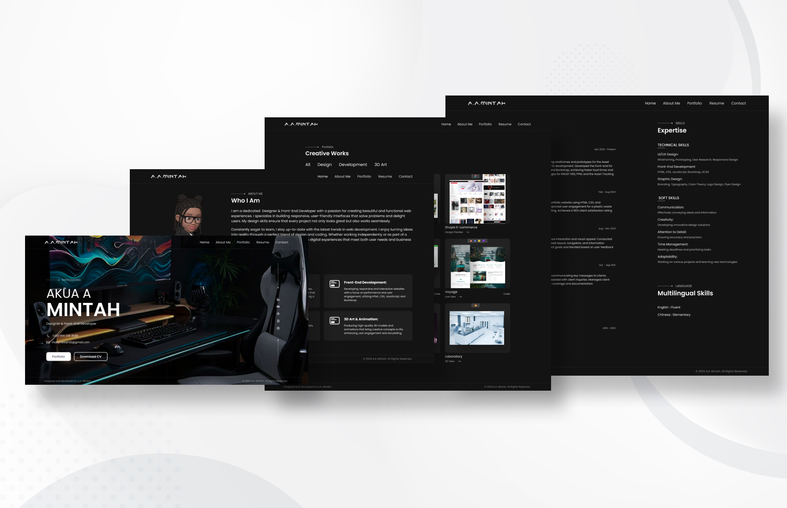

# Portfolio Website

## About

This portfolio website showcases my work, skills, and projects. Built with HTML, CSS, and JavaScript, it features a clean, responsive design that highlights my UI/UX design and front-end development expertise.

## Demo

 

## Technologies Used

- **HTML**: For the structure of the webpage.
- **CSS**: For styling and layout.
- **JavaScript**: For interactive features and dynamic content.

## License

MIT

## Contact

Akua Adomako Mintah - [marymintah32@gmail.com](mailto:marymintah32@gmail.com)

Project Link: [A.A.Mintah](https://aamintah.netlify.app/)
